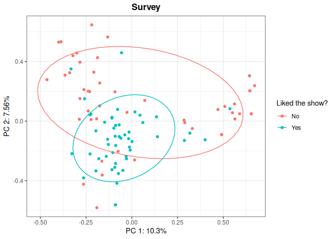

<!-- README.md is generated from README.Rmd. Please edit that file -->

# kerntools

<!-- badges: start -->
<!-- badges: end -->

The goal of kerntools is to provide R tools for working with a family of
Machine Learning methods called kernel methods. It can be used to
complement other R packages like `kernlab`. Right now, `kerntools`
implements several kernel functions for treating non-negative and real
vectors, real matrices, categorical and ordinal variables, sets, and
strings. Several tools for studying the resulting kernel matrix or to
compare two kernel matrices are available. These diagnostic tools may be
used to infer the kernel(s) matrix(ces) suitability in training models.
This package also provides functions for computing the feature
importance of Support Vector Machines (SVMs) models, and display
customizable kernel Principal Components Analysis (PCA) plots. For
convenience, widespread performance measures and feature importance
barplots are available for the user.

## Installation

### Installation and loading

Installing `kerntools` is easy. In the R console:

``` r
install.packages("kerntools")
```

Once the package is installed, it can be loaded anytime typing:

``` r
library(kerntools)
```

### Dependencies

`kerntools` requires R (\>= 2.10). Currently, it also relies on the
following packages:

- `dplyr`
- `ggplot2`
- `kernlab`
- `methods`
- `reshape2`
- `stringi`

Usually, if some of these packages are missing in your library, they
will be installed automatically when `kerntools` is installed.

## A quick example: kernel PCA

Imagine that you want to perform a (kernel) PCA plot but your dataset
consist of categorical variables. This can be done very easily with
`kerntools`! First, you chose an appropriate kernel for your data (in
this example, the Dirac kernel for categorical variables), and then you
pass the output of the `Dirac()` function to the `kPCA()` function.

``` r
head(showdata)
#>   Favorite.color   Favorite.actress     Favorite.actor    Favorite.show
#> 1            red      Sophie Turner      Josh O'Connor        The crown
#> 2          black         Soo Ye-jin           Hyun Bin       Bridgerton
#> 3            red Lorraine Ashbourne       Henry Cavill       Bridgerton
#> 4           blue      Sophie Turner       Alvaro Morte La casa de papel
#> 5            red      Sophie Turner Michael K Williams         The wire
#> 6         yellow      Sophie Turner      Kit Harington  Game of Thrones
#>   Liked.new.show
#> 1            Yes
#> 2             No
#> 3            Yes
#> 4             No
#> 5            Yes
#> 6             No
KD <- Dirac(showdata[,1:4])
dirac_kpca <- kPCA(KD,plot=c(1,2),title="Survey", name_leg = "Liked the show?", 
                   y=showdata$Liked.new.show, ellipse=0.66)
dirac_kpca$plot
```



You can customize your kernel PCA plot: apart from picking which
principal components you want to display (in the example: PC1 and PC2),
you may want to add a title, or a legend, or use different colors to
represent an additional variable of interest, so you can check patterns
on your data. To see in detail how to customize a `kPCA()` plot, please
refer to the documentation. The projection matrix is also returned
(`dirac_kpca$projection`), so you may use it for further analyses and/or
creating your own plot.

<!-- ## Kerntools features and detailed examples: -->

## Main kerntools features

Right now, `kerntools` can deal effortlessly with the following kinds of
data:

- Real vectors: Linear, RBF and Laplacian kernels.
- Real matrices: Frobenius kernel.
- Counts or Frequencies (non-negative numbers): Bray-Curtis and Ruzicka
  (quantitative Jaccard) kernels.
- Categorical data: Overlap / Dirac kernel.
- Sets: Intersect and Jaccard kernels.
- Ordinal data and rankings: Kendall’s tau kernel.
- Strings and Text: Spectrum kernel.

Several tools for visualizing and comparing kernel matrices are
provided.

Regarding kernel PCA, `kerntools` allows the user to:

- Compute a kernel PCA from any kernel matrix, be it computed with
  `kerntools` or provided by the user.
- Display customizable PCA plots
- (When possible) Compute and display the contribution of variables to
  each principal component.
- Compare two or more PCAs generated from the same set of samples using
  Co-inertia and Procrustes analysis.

When using some specific kernels, `kerntools` computes the importance of
each variable or feature in a Support Vector Machine (SVM) model.
`kerntools` does not train SVMs or other prediction models, but it can
recover the feature importance of models fitted with other packages (for
instance `kernlab`). These importances can be sorted and summarized in a
customizable barplot.

Finally, the following performance measures for regression, binary and
multi-class classification are implemented:

- Regression: Normalized Mean Squared Error
- Classification: accuracy, specificity, sensitivity, precision and F1
  with (optional) confidence intervals, computed using normal
  approximation or bootstrapping.

## Example data

`kerntools` contains a categorical toy dataset called `showdata`.

## Documentation

### Vignette

To see detailed and step-by-step examples that illustrate the main cases
of use of `kerntools`, please have a look to the vignette:

``` r
browseVignettes(kerntools)
```

### Additional help

Remember that detailed, argument-by-argument documentation is available
for each function:

``` r
help(kPCA) ## or the specific name of the function
?kPCA
```

The documentation of the example dataset is available in an analogous
way, typing:

``` r
help(showdata)
?showdata
```

### More about kernels

To know more about kernel functions, matrices and methods, you can
consult the following reference materials:

- Bishop, C. M., & Nasrabadi, N. M. (2006). *Pattern recognition and
  machine learning* (Vol. 4, No. 4, p. 738). Chapter 6, pp. 291-323. New
  York: springer.

- Müller, K. R., Mika, S., Tsuda, K., & Schölkopf, K. (2018) *An
  introduction to kernel-based learning algorithms*. In Handbook of
  neural network signal processing (pp. 4-1). CRC Press.

- Shawe-Taylor, J., & Cristianini, N. (2004). *Kernel methods for
  pattern analysis*. Cambridge university press.
